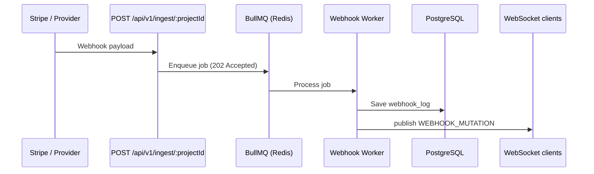

# Frontend WebSocket Integration Guide

This guide explains how to connect a frontend dashboard to Velo real-time webhook events over WebSockets.

**HTTP API base (development):** `http://localhost:3000/api/v1`  
**WebSocket base (development):** `ws://localhost:3000`

See also: [Frontend Auth Integration Guide](./frontend-auth-integration.md)

---

## Overview

Velo pushes **live webhook log updates** to dashboard clients when the ingestion worker finishes processing a job (forward to client URL, persist log, then broadcast).

| Concept | Value |
|---------|-------|
| Protocol | Native WebSocket (Elysia/Bun pub/sub) |
| Scope | One room per project |
| Direction | Server → client only (no client commands yet) |
| Event type | `WEBHOOK_MUTATION` |



---

## Connection

### Endpoint

```
ws://localhost:3000/ws/projects/:projectId
```

| Param | Description |
|-------|-------------|
| `projectId` | UUID of the project whose webhook activity you want to watch |

**Production:** use `wss://` on your API host:

```
wss://api.yourdomain.com/ws/projects/:projectId
```

### Room model

On connect, the server subscribes the socket to an internal topic:

```
project:{projectId}
```

Only clients connected to `/ws/projects/{same-uuid}` receive events for that project.

---

## Message Format

All messages are **JSON strings**. Parse with `JSON.parse(event.data)`.

### `WEBHOOK_MUTATION`

Sent when a webhook job completes and a log row is saved.

```json
{
  "type": "WEBHOOK_MUTATION",
  "log": {
    "id": "550e8400-e29b-41d4-a716-446655440000",
    "endpointId": "660e8400-e29b-41d4-a716-446655440001",
    "projectId": "772d66d1-2f13-4683-b4ce-816703cd1aba",
    "provider": "stripe",
    "providerEventId": "evt_1234567890",
    "requestHeaders": { "x-provider": "stripe" },
    "requestPayload": { "id": "evt_1234567890", "type": "payment_intent.succeeded" },
    "responseStatus": 200,
    "responseHeaders": { "content-type": "application/json" },
    "responseBody": "{\"received\":true}",
    "status": "SUCCESS",
    "errorMessage": null,
    "latencyMs": 142,
    "createdAt": "2026-05-22T12:00:00.000Z",
    "updatedAt": "2026-05-22T12:00:00.000Z"
  }
}
```

### Log field reference

| Field | Type | Description |
|-------|------|-------------|
| `id` | `string` (UUID) | Webhook log ID |
| `endpointId` | `string` (UUID) | Target endpoint |
| `projectId` | `string` (UUID) | Owning project |
| `provider` | `string` | Source provider (from `X-Provider` header on ingest) |
| `providerEventId` | `string?` | External event ID (dedup hint) |
| `requestHeaders` | `object` | Incoming request headers |
| `requestPayload` | `object` | Incoming webhook body |
| `responseStatus` | `number?` | HTTP status from forwarded request |
| `responseHeaders` | `object?` | Response headers from client backend |
| `responseBody` | `string?` | Raw response body from client backend |
| `status` | `"SUCCESS" \| "FAILED" \| "RETRYING"` | Processing outcome |
| `errorMessage` | `string?` | Internal/forward error message |
| `latencyMs` | `number?` | Forward round-trip in milliseconds |
| `createdAt` | `string` (ISO date) | Log creation time |
| `updatedAt` | `string` (ISO date) | Last update time |

---

## Vanilla JavaScript

```typescript
const projectId = '772d66d1-2f13-4683-b4ce-816703cd1aba';
const ws = new WebSocket(`ws://localhost:3000/ws/projects/${projectId}`);

ws.onopen = () => {
  console.log('Connected to Velo live feed');
};

ws.onmessage = (event) => {
  const message = JSON.parse(event.data);

  if (message.type === 'WEBHOOK_MUTATION') {
    console.log('New webhook log:', message.log);
    // Prepend to dashboard list, update counters, etc.
  }
};

ws.onerror = (error) => {
  console.error('WebSocket error:', error);
};

ws.onclose = () => {
  console.log('Disconnected from Velo live feed');
};

// Cleanup when leaving the page
// ws.close();
```

---

## React Hook

```tsx
import { useEffect, useRef, useState } from 'react';

type WebhookLog = {
  id: string;
  endpointId: string;
  projectId: string;
  provider: string;
  status: 'SUCCESS' | 'FAILED' | 'RETRYING';
  latencyMs?: number;
  createdAt: string;
  // ...other fields from API
};

type WebhookMutationMessage = {
  type: 'WEBHOOK_MUTATION';
  log: WebhookLog;
};

const WS_BASE = import.meta.env.VITE_WS_BASE_URL ?? 'ws://localhost:3000';

export function useProjectWebhookFeed(projectId: string | null) {
  const [logs, setLogs] = useState<WebhookLog[]>([]);
  const [connected, setConnected] = useState(false);
  const wsRef = useRef<WebSocket | null>(null);

  useEffect(() => {
    if (!projectId) return;

    const ws = new WebSocket(`${WS_BASE}/ws/projects/${projectId}`);
    wsRef.current = ws;

    ws.onopen = () => setConnected(true);

    ws.onmessage = (event) => {
      const message: WebhookMutationMessage = JSON.parse(event.data);

      if (message.type === 'WEBHOOK_MUTATION') {
        setLogs((prev) => [message.log, ...prev]);
      }
    };

    ws.onclose = () => setConnected(false);

    ws.onerror = () => setConnected(false);

    return () => {
      ws.close();
      wsRef.current = null;
    };
  }, [projectId]);

  return { logs, connected };
}
```

**Usage in a project dashboard page:**

```tsx
function ProjectLiveLogs({ projectId }: { projectId: string }) {
  const { logs, connected } = useProjectWebhookFeed(projectId);

  return (
    <div>
      <span>{connected ? '🟢 Live' : '🔴 Offline'}</span>
      <ul>
        {logs.map((log) => (
          <li key={log.id}>
            {log.provider} — {log.status} — {log.latencyMs}ms
          </li>
        ))}
      </ul>
    </div>
  );
}
```

---

## Reconnection Strategy

The API does not send heartbeats yet. Implement client-side reconnect for production dashboards:

```typescript
function connectWithRetry(projectId: string, onMessage: (data: unknown) => void) {
  let retries = 0;
  const maxRetries = 10;
  let ws: WebSocket;

  const connect = () => {
    ws = new WebSocket(`ws://localhost:3000/ws/projects/${projectId}`);

    ws.onopen = () => {
      retries = 0;
    };

    ws.onmessage = (event) => {
      onMessage(JSON.parse(event.data));
    };

    ws.onclose = () => {
      if (retries >= maxRetries) return;
      const delay = Math.min(1000 * 2 ** retries, 30_000);
      retries += 1;
      setTimeout(connect, delay);
    };
  };

  connect();

  return () => ws?.close();
}
```

On reconnect, fetch historical logs via REST to fill any gap:

```
GET /api/v1/projects/:id/webhook-logs
```

---

## Dev Setup (Vite)

If the frontend runs on `http://localhost:5173`, proxy WebSocket through Vite:

```typescript
// vite.config.ts
export default defineConfig({
  server: {
    proxy: {
      '/ws': {
        target: 'ws://localhost:3000',
        ws: true,
      },
      '/api': {
        target: 'http://localhost:3000',
        changeOrigin: true,
      },
    },
  },
});
```

Then connect with a relative URL:

```typescript
const protocol = window.location.protocol === 'https:' ? 'wss:' : 'ws:';
const ws = new WebSocket(`${protocol}//${window.location.host}/ws/projects/${projectId}`);
```

The API currently enables CORS for `http://localhost:5173` on HTTP routes. WebSocket upgrades are separate — prefer the proxy approach in local dev.

---

## Security

> **Important:** WebSocket connections are **not authenticated** in the current API version.

Any client that knows a `projectId` UUID can subscribe to that project's live feed.

**Frontend mitigations (until server auth lands):**

- Only connect after the user is logged in and has loaded a project they own
- Never expose project IDs in public URLs without access control
- Treat live payloads as sensitive (headers/bodies may contain PII)

**Planned hardening (not implemented yet):**

- Validate JWT on WebSocket `open`
- Reject connections for projects the user is not a member of

For HTTP auth (login, cookies, Bearer tokens), see [Frontend Auth Integration Guide](./frontend-auth-integration.md).

---

## When Events Fire

| Trigger | WebSocket event |
|---------|-----------------|
| `POST /api/v1/ingest/:projectId` processed successfully | `WEBHOOK_MUTATION` |
| Ingest queued but worker not running | No event (job stays in Redis) |
| No active endpoint for project | No event (job fails permanently) |
| Manual log create via REST API | No event (REST-only today) |

Ensure **Redis** and the **webhook worker** are running (`docker compose -f compose.dev.yml up`) or live updates will not arrive.

---

## Environment Variables

```env
# Frontend (.env)
VITE_WS_BASE_URL=ws://localhost:3000
VITE_API_BASE_URL=http://localhost:3000/api/v1
```

Production example:

```env
VITE_WS_BASE_URL=wss://api.yourdomain.com
VITE_API_BASE_URL=https://api.yourdomain.com/api/v1
```

---

## Integration Checklist

- [ ] Connect to `/ws/projects/:projectId` when user opens a project dashboard
- [ ] Parse `WEBHOOK_MUTATION` messages and update UI optimistically
- [ ] Load initial log history via `GET /api/v1/projects/:id/webhook-logs`
- [ ] Close WebSocket on route unmount / project switch
- [ ] Implement reconnect with exponential backoff
- [ ] Show connection status (`connected` / `offline`)
- [ ] Do not rely on WS as the sole source of truth — persist via REST
- [ ] Gate connection behind authenticated routes in your app

---

## Troubleshooting

| Symptom | Likely cause |
|---------|--------------|
| Connects but no messages | Redis/worker down, or no ingest traffic |
| Immediate disconnect | Wrong `projectId`, server not running |
| CORS/proxy errors in browser | Use Vite WS proxy or same-origin deployment |
| Duplicate logs in UI | Dedupe by `log.id` when merging WS + REST data |
| `401` on REST but WS works | WS has no auth — expected until auth is added |

**Quick test:** send a test webhook while connected:

```bash
curl -X POST "http://localhost:3000/api/v1/ingest/<project-id>" \
  -H "Content-Type: application/json" \
  -H "X-Provider: stripe" \
  -d '{"id":"evt_test","type":"benchmark.event"}'
```

You should see a `WEBHOOK_MUTATION` message shortly after (requires an active endpoint configured for that project).
